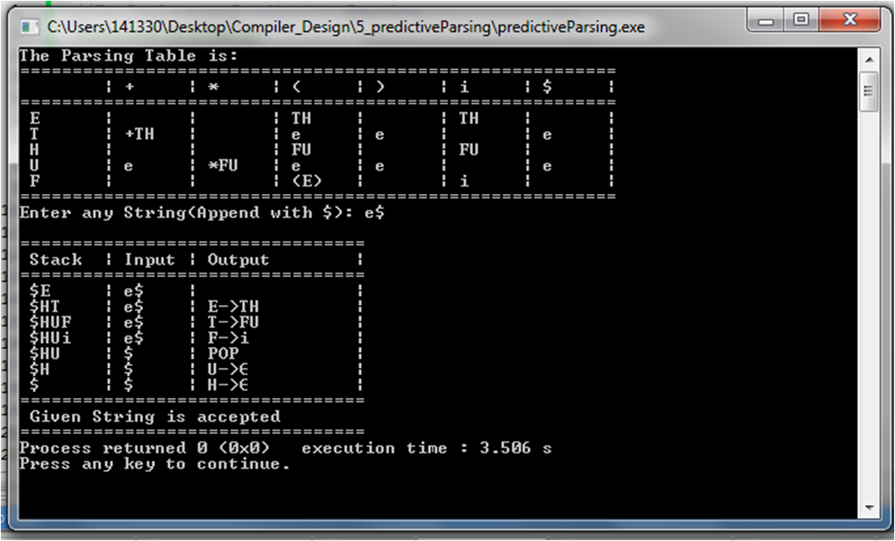

# Validity of Expression in Predictive Parsing Table

Input: A string w and a parsing table M for grammar G.

Output: If w is in L(G) – use non-recursive predictive parsing; otherwise, an error indication.

