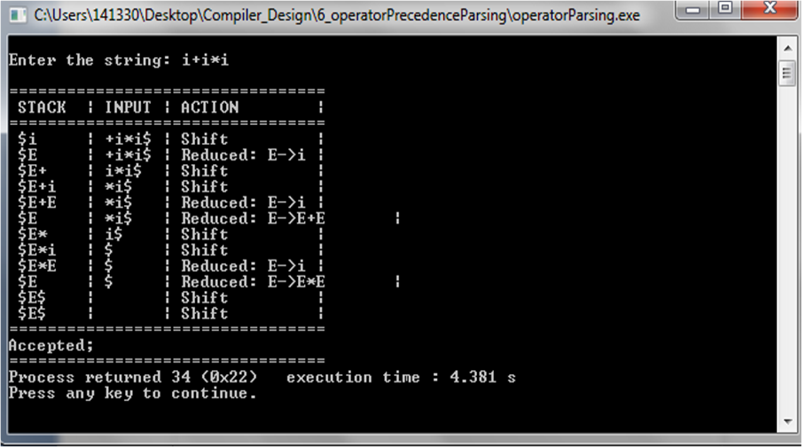
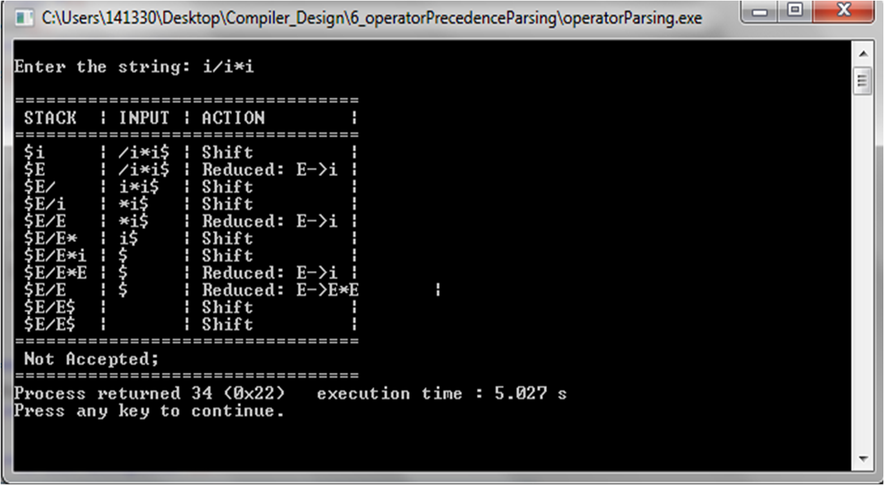

# Validity of Expression using Operator Precedence Parsing.

Input: an operator precedence matrix or precedence functions, sentence with $ appended to the end

Assumptions: $ <· Vi ·> $ where Vi Є Vt, $ Є V

Output: Expression valid or not.

